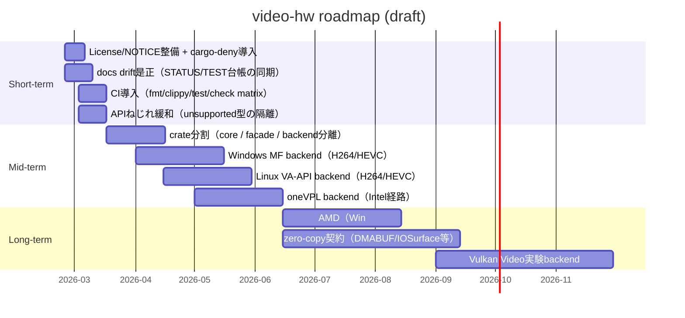

# video-hw 深掘り調査レポート

## エグゼクティブサマリ

本調査では、entity["company","GitHub","code hosting company"]上の `Sanzentyo/video-hw` リポジトリを起点に、現行実装（単一crate、VideoToolbox / NVIDIAバックエンド）・API・テスト/ベンチ/スクリプト・ドキュメント体系・依存関係・ライセンス運用面を実務視点で精査し、MIT/Apache公開を維持しながら将来のマルチベンダ・マルチOS対応へ拡張する設計案とロードマップを提示します。レビュー対象の中心ファイルは `src/lib.rs`（公開APIとバックエンド切替）fileciteturn61file0L1-L1、`src/contract.rs`（共通型・エラー・backend option）fileciteturn62file0L1-L1、`src/nv_backend.rs` / `src/vt_backend.rs`（実バックエンド）fileciteturn61file2L1-L1fileciteturn61file4L1-L1、および `docs/status/STATUS.md`（最新の検証結果と性能比較の集約）fileciteturn64file12L1-L1です。

結論として、現状の `video-hw` は「**同一APIでVT/NVを切替できる**」「**低レベル制御と計測を意識したベンチ基盤が揃っている**」点が強く、特に **decode性能はFFmpeg比較で優位な条件がある**一方で、実務で配布可能なMIT/Apacheプロジェクトとして見ると、以下が主要なボトルネックです。

- **API契約のねじれ**：型としては `DecodedFrame::Nv12/Rgb24` や `RawFrameBuffer::Nv12/Rgb24` を持ちながら、現行の公開レイヤでは decode が **Metadata固定**で、encode は **ARGBのみ**を受け付けます（未対応バッファは `InvalidInput` を返す）。fileciteturn61file0L1-L1fileciteturn62file0L1-L1
- **ドキュメント漂流（docs drift）**：`docs/spec/TEST_SPEC_INVENTORY.md` や `docs/status/STATUS.md` が、存在しないファイル/トグル/テスト（例：VT GPU transform、`vt_metal_transform.rs`、VT側NV12→RGB workerテスト等）を前提に記述しており、実装と整合しません。fileciteturn74file14L1-L1fileciteturn64file12L1-L1
- **配布・CI・依存の現実解が未整備**：NVIDIAバックエンドは環境依存（SDK libs, nvcc/ツールチェーン）で `cargo check --all-targets --features backend-nvidia` が失敗し得る、と `STATUS.md` 自体が明言しています。fileciteturn64file12L1-L1
- **ライセンス汚染リスクの高い領域**：NVIDIA Video Codec SDKのライセンスは、SDKをオープンソース義務のあるライセンスの対象にしてはならない旨を含みます（「SDKをオープンソースライセンスの対象にする使い方の禁止」等）。MIT/Apache公開を維持するには、**SDKヘッダ/ライブラリの同梱や、派生物配布の扱い**を明確化し、設計として隔離する必要があります。citeturn7search5turn7search6turn7search9

提案の核は、「**公開契約（core）を完全にMIT/Apacheの純Rust層に閉じ、ベンダSDK/OS APIは“任意backend crate + 動的ロード + 外部インストール前提”で隔離**」することです。加えて、短期（2–4週）で docs drift・ライセンス・CI・APIのねじれを抑え、半年程度で Intel/AMD/Windows一般対応（oneVPL / AMF / Media Foundation / VA-API 等）を段階的に増やすロードマップが現実的です。

## 2026-02-23 現行反映メモ（本文保持のための追記）

本書本文は調査時点の記述として保持し、現行実装との差分のみ追記する。

- 現行構成は workspace（`crates/video-hw-core` + `crates/video-hw`）へ移行済み
- 本文中の `src/*` / `tests/*` / `benches/*` 参照は、現行では `crates/video-hw/src/*` / `crates/video-hw/tests/*` / `crates/video-hw/benches/*` に対応
- NVIDIA 依存は `nvidia-video-codec-sdk` ラッパー経由で、SDK 本体は利用者が別途取得・パス指定する前提
- CI は現時点で導入を後段化し、手動検証を継続

## 現状分析

### リポジトリの全体像と主要ファイル

READMEが示すとおり、現行は root `src/` に実装を集約し、featureで backend 実装を有効化しつつ、実行時に `BackendKind`（Auto/VideoToolbox/Nvidia）で選択する設計です。fileciteturn64file0L1-L1
公開APIの中心は `src/lib.rs` にあり、共通型・エラー体系は `src/contract.rs` に集約されています。fileciteturn61file0L1-L1fileciteturn62file0L1-L1

現行で「実務的に重要」なファイルを、用途別に抜粋して整理すると以下です（抜粋・代表）。

| 区分 | ファイル | 役割 | 備考 |
|---|---|---|---|
| 公開API | `src/lib.rs`fileciteturn61file0L1-L1 | `DecodeSession`/`EncodeSession`、backend選択、(un)pack等 | decodeは現状 `Metadata`化が基本 |
| 契約/型 | `src/contract.rs`fileciteturn62file0L1-L1 | `Codec`, `BitstreamInput`, `RawFrameBuffer`, `DecodedFrame`, `BackendError` 等 | 型は広いが実装は一部限定 |
| NVIDIA | `src/nv_backend.rs`fileciteturn61file2L1-L1 / `src/nv_meta_decoder.rs`fileciteturn34file2L1-L1 | NVENC/NVDEC 経路 | SDK/ドライバ環境依存が大きい |
| VideoToolbox | `src/vt_backend.rs`fileciteturn61file4L1-L1 | VT encode/decode | macOS + feature に依存 |
| ビットストリーム | `src/bitstream.rs`fileciteturn64file9L1-L1 | Annex-B増分パース、AU再構成 | chunk境界耐性が重要 |
| 変換/パイプライン | `src/transform.rs`fileciteturn62file2L1-L1 / `src/pipeline_scheduler.rs`fileciteturn62file3L1-L1 / `src/backend_transform_adapter.rs`fileciteturn62file5L1-L1 | NV12→RGBのCPU worker、bounded queue、世代管理 | VT側はstubに近い |
| E2E | `tests/e2e_video_hw.rs`fileciteturn63file7L1-L1 | decode/encodeの最低限同等性 | 環境依存skipが含まれる（docsにも明記）fileciteturn74file14L1-L1 |
| ベンチ | `benches/decode_bench.rs`fileciteturn63file2L1-L1 | decode性能の計測 | sample動画が前提 |
| 比較スクリプト | `scripts/benchmark_ffmpeg_nv_precise.rs`fileciteturn64file17L1-L1 / `scripts/benchmark_ffmpeg_vt_precise.rs`fileciteturn64file14L1-L1 | FFmpeg比較、verify/equal-raw-input等 | “比較可能性”が強み |
| 状態/レポート | `docs/status/STATUS.md`fileciteturn64file12L1-L1 | 最新の検証結果、比較結果の要約 | docs drift もここに混入 |

また、`crates/video-hw/` が残存しており、過去構成の痕跡（レガシー）として混乱要因になり得ます。fileciteturn62file1L1-L1
`docs/spec/TEST_SPEC_INVENTORY.md` では「crates配下の旧E2Eは削除済み」と書かれますが、少なくともディレクトリ自体は残っており、整合が取りづらい状態です。fileciteturn74file14L1-L1

### 公開APIの挙動と契約のねじれ

`contract.rs` は入力・出力の型を広めに定義しています。たとえば `BitstreamInput` は Annex-B chunk / raw NAL / length-prefixed sample を許容し、`RawFrameBuffer` は ARGB（owned/shared）だけでなく NV12/RGB24 を型として持ちます。fileciteturn62file0L1-L1

一方 `lib.rs` の公開レイヤでは、次の“現実の制約”が入っています。fileciteturn61file0L1-L1

- decode：バックエンドが返す `Frame` を `legacy_to_decoded_frame` で `DecodedFrame::Metadata` に落としており、**現行APIでのdecode結果は（原則）メタデータのみ**になります。
- encode：`encode_frame_to_legacy` が `RawFrameBuffer::Nv12` と `RawFrameBuffer::Rgb24` を明示的に `InvalidInput` で拒否しており、**現行APIでのencode入力は ARGB に限定**されます。

この「型は一般化されているが、公開APIは一部限定」の状態は、利用側にとって学習コストと落とし穴を増やします。特に、将来のzero-copy（NV12/P010等）やDMA共有を見据えるなら、**“今は拒否するが将来は受ける” 型をそのまま公開し続ける**より、feature-gatedの明確な契約（例：`EncodeInput::Argb` のみ公開、NV12は `unstable` feature）に寄せた方が、互換性と実務の両面で安全です。

### テスト、ベンチ、比較スクリプトと“最新結果”の照合

`docs/status/STATUS.md` は、fmt/check/test/bench の“最新状態”を文章で記録しており、VT feature でのテストやベンチが通ること、NVIDIA feature はツールチェーン・SDK libs の不足で失敗し得ることを明確にしています。fileciteturn64file12L1-L1
この点は、READMEが示す環境変数（例：`NVIDIA_VIDEO_CODEC_SDK_PATH`）や feature 指定と整合します。fileciteturn64file0L1-L1

E2Eの棚卸しとして `docs/spec/TEST_SPEC_INVENTORY.md` が存在し、decodeの期待フレーム数（303）や、encodeのPTS単調性、入力検証の期待などが整理されています。fileciteturn74file14L1-L1
一方で、この台帳は VT transform worker のテストなど、現行コードに見当たらない項目を含みます（`src/backend_transform_adapter.rs` の VT adapter は現状 stub で、NV側も “test cfg限定” のCPU transformが中心）。fileciteturn62file5L1-L1
つまり、**テスト“台帳”の更新が実装の実態を反映できていない**状態です。実務では、台帳が“正”であるほど変更容易性が上がるため、短期で是正すべき技術的負債です。

比較基盤としては、NV/VtそれぞれにFFmpeg比較（repeat/verify/equal-raw-input 等）を行うスクリプト群があり、ドキュメントでも運用されていることが明記されています。fileciteturn64file12L1-L1fileciteturn64file17L1-L1fileciteturn64file14L1-L1
この「比較可能性を最初から織り込む」姿勢は非常に強い資産なので、後述の改善案ではこの基盤を“CIに載せられる形”に再構成する方針を中心に据えます。

### ライセンス表記と依存関係の状況

`Cargo.toml` は `MIT OR Apache-2.0` のデュアルライセンス表記を含みます。fileciteturn51file1L1-L1
ただし、公開実務でよく求められる「LICENSEファイル（MIT/Apache本文）」や「THIRD_PARTY_NOTICES」等の運用物は、少なくとも検索ベースでは明確に確認できず、整備余地があります（後述の改善案で“最優先”扱い）。

最も重要なライセンス汚染リスクは、entity["company","NVIDIA","gpu vendor"]の Video Codec SDK です。SDKライセンスには、SDKをオープンソースライセンスの対象にするような使い方を禁じる条項が含まれています。citeturn7search5turn7search6
一方でNVENC/NVDECを使うには、FFmpeg統合を使う方法と、NVENC/NVDEC APIを直接使う方法があり、後者はより細かい制御を可能にします。citeturn7search9
MIT/Apache維持のためには、**SDK（ヘッダ/サンプル/ライブラリ）を“配布物に含めない”設計**、または“ユーザがEULAに同意して別途取得する”導線を、コード・ドキュメント・feature設計に落とし込む必要があります。

## 評価指標と現状スコア

ここでは、ユーザー指定の評価指標を「実務の意思決定に使える形」に落とし込み、**定性的スコア（5点満点）＋根拠（可能なら定量）**で示します。性能の定量は、`docs/status/STATUS.md` に記録された FFmpeg比較の“直近再計測”値（warmup/repeat/verify/equal-raw-input等）を根拠にしています。fileciteturn64file12L1-L1

| 指標 | 現状スコア | 根拠 |
|---|---:|---|
| 使いやすさ（API ergonomics） | 3.0 | `DecodeSession/EncodeSession` は単純で学習しやすい一方、型の表現力（NV12等）と実挙動（reject/Metadata固定）の乖離がある。fileciteturn61file0L1-L1 |
| 拡張性 | 3.0 | backendはenumで選択しやすいが、新backend追加は中心crate改修前提。再設計案はdocsに存在。fileciteturn64file11L1-L1 |
| モジュール性 | 3.0 | `contract/bitstream/transform/pipeline` に分離されているが、単一crateゆえにOS専用依存の境界がやや曖昧、レガシー残存もあり。fileciteturn62file1L1-L1 |
| パフォーマンス（スループット/レイテンシ） | 4.0 | VT/NVとも decode はFFmpeg比で優位な条件があり、encodeは条件次第でFFmpegが速い（特に同一raw入力条件）と記録。fileciteturn64file12L1-L1 |
| リアルタイム性 | 2.5 | streaming probe例はあるが、公開APIの `reap_timeout` は実質 `try_reap` と同挙動で“待ち”契約が弱い。fileciteturn61file0L1-L1 |
| メモリ/CPU/GPU使用 | 3.0 | decodeがMetadata中心なためメモリは軽いが、encodeはARGB入力でcopy/uploadが支配的になりやすく、内部メトリクスでcopy指標を扱う方向性が示されている。fileciteturn64file12L1-L1 |
| クロスプラットフォーム性 | 2.5 | macOS（VT）とWindows/Linux（NV）に限定。Intel/AMD/汎用Windows（MF）/Linux（VA-API/V4L2）など未統合。fileciteturn64file0L1-L1 |
| セキュリティ | 3.0 | `BackendError` に分類があり、bitstreamパースのunit testもあるが、fuzzやASan/UBSan等の運用が見えない。fileciteturn74file14L1-L1 |
| ライセンス汚染リスク | 2.0 | NVIDIA SDKの条項が強く、SDK同梱/派生配布を避ける設計が必須。citeturn7search5turn7search6turn7search9 |
| ビルド/配布容易性 | 2.5 | VTはOS提供frameworkで比較的容易だが、NVはSDK libs/nvcc等に強く依存し、`STATUS.md`でも失敗し得る点が明記。fileciteturn64file12L1-L1 |

## 実装ロードマップ

最後に、短期/中期/長期のマイルストーンをガントで提示し、リスクと緩和策、必要スキルを整理します。

### マイルストーンとタイムライン



### 性能比較のグラフ

以下は `STATUS.md` に記録された “直近再計測（warmup 1 / repeat 3 / verify / equal-raw-input）” の値を中心に、**総実行時間（秒）**として比較したものです。ここでは「合計時間/300フレーム相当（例：テスト資産の条件）」という前提で、平均1フレームあたりの概算も導出できます（例：0.286s/300 ≒ 0.95ms）。fileciteturn64file12L1-L1

```mermaid
xychart-beta
  title "FFmpeg比較（総時間s、同一raw入力条件の代表値）"
  x-axis ["NV H264 decode","NV H264 encode","NV HEVC decode","NV HEVC encode","VT H264 decode","VT H264 encode","VT HEVC decode","VT HEVC encode"]
  y-axis "seconds (lower is better)" 0 --> 1.0
  bar "video-hw" [0.286,0.457,0.315,0.446,0.176,0.334,0.168,0.381]
  bar "ffmpeg"   [0.480,0.224,0.498,0.230,0.853,0.304,0.825,0.356]
```



読み取り（実務上の意味づけ）：
- **decodeはVT/NVとも video-hw がFFmpegより速い傾向**が見える（例：VT H264 decode 0.176s vs 0.853s）。fileciteturn64file12L1-L1
- **encodeは“同一raw入力”条件ではFFmpegが速い**ケースが目立つ（NV H264 encode 0.457s vs 0.224s 等）。fileciteturn64file12L1-L1
- よって、短期の性能課題は「encodeの入力copy/lock待ち/パイプライン重なり不足」を中心に最適化するのが合理的です（この方向性はNVの設計文書にも現れている）。fileciteturn61file3L1-L1

## 改善案

ここでは、現行の設計意図（FFmpeg比較可能性、backend差分の局所化、session switching等）を尊重しつつ、MIT/Apache公開の継続性と拡張性を最大化するための改善を、優先度と粗い工数感（人日）で提示します。再設計の叩き台として、`docs/plan/API_REDESIGN_BLUEPRINT_2026-02-21.md` が既に存在するため、ここでは“その文書を実装可能なタスク列に落とす”ことに重点を置きます。fileciteturn64file11L1-L1

### 優先度が高い改善

**ライセンス・配布の基盤整備（最優先、1–3人日）**
MIT/Apacheを維持したいという要件に対し、最も事故りやすいのは「(a) ライセンス本文の欠落」「(b) NVIDIA SDK周りの扱いが曖昧」「(c) 依存ライセンス軽視で後から公開できなくなる」の3点です。NVIDIA SDKは“オープンソースライセンス対象化を禁じる”趣旨を含むため、SDKを同梱/派生配布しない運用を明記した上で、コード上もそれを強制する必要があります。citeturn7search5turn7search6turn7search9
提案：
- ルートに `LICENSE-MIT` / `LICENSE-APACHE` / `NOTICE` / `THIRD_PARTY_NOTICES` を追加し、公開物としての形式を確定。
- `cargo-deny`（ライセンス/脆弱性/重複）を導入し、CIで強制（後述）。
- NVIDIA backendは「SDKを同梱しない」「ユーザが別途取得」「ビルド時は“存在すれば有効”」を前提に feature を再設計（例：`backend-nv` + `nv-sdk-external`）。

**docs driftの根絶（最優先、2–5人日）**
`docs/spec/TEST_SPEC_INVENTORY.md` と実装がズレているのは、将来のリファクタ/APIs変更時に最もコストを増やします。fileciteturn74file14L1-L1
提案：
- docsの各“断定”に対し、`#[test]` 名・ファイルパス・feature条件を紐付ける機械処理（簡易で良い）。
- 存在しないファイル/トグル（例：VT GPU transformや `vt_metal_transform.rs`）を、(a) 実装する、(b) docsから削除、(c) “計画”セクションへ移動、のいずれかに整理。fileciteturn64file12L1-L1

**API契約のねじれ解消（P0、3–7人日）**
`RawFrameBuffer` がNV12/RGB24を持つ一方、公開APIでencodeが拒否するのは、利用者体験として事故源です。fileciteturn61file0L1-L1
提案（段階的）：
- 短期：公開API上の `RawFrameBuffer` を「現時点でサポートする型」に絞る、もしくは `#[non_exhaustive]` + `unstable` feature による隔離。
- 中期：`DecodeOutputMode`（Metadata/CPU-NV12/CPU-RGB/NativeSurface）を契約化し、`DecodedFrame` のvariantが“実際に出る”ことを保証（設計案はNVのセッション再設計案にも存在）。fileciteturn61file3L1-L1

**CIの導入とビルド成立性の改善（P0、2–6人日）**
NVIDIA feature が環境依存で壊れやすいのは避けられませんが、“最低限、コンパイルが通ること”を保証しないと、利用側がrev固定しても将来壊れます。fileciteturn64file12L1-L1
提案：
- **GPU不要のCI**：`fmt/clippy/test`（backend無効、VT無効）、`check`（各targetのcompile-only）、`cargo-deny`。
- **GPU必要のCI**：self-hosted runner（Windows/Linux + NVIDIA）を追加し、NVのE2EとFFmpeg比較スクリプトの“縮小版”を夜間実行。

### 実装変更案の例（API/抽象化/エラーハンドリング）

- **Backendsをenum直結から“backend registry + trait object”へ**：追加backendが `video-hw` 本体の破壊的変更を招かないようにする。
- **エラーに“恒久/一時/環境依存skip”を明確化**：現状 `TemporaryBackpressure` はあるが、E2Eではメッセージ依存skipがあり脆い。fileciteturn74file14L1-L1
- **`reap_timeout` を本当に“待つ”APIにする**：リアルタイム用途では、busy-pollは許容しづらい。fileciteturn61file0L1-L1

## ハードウェアとコーデック対応計画

このセクションは、ユーザ指定の候補（Intel/AMD/Qualcomm/Vulkan Video/NVIDIA/Apple/CPUソフト）を、MIT/Apache公開を維持しながら「どの層で吸収するべきか」「依存/権限/ドライバ」「FFI/SDK接続方法」「利点欠点」を整理します。最初に対象ベンダを列挙します（以降、同名は重複表示を避けます）。

対象ベンダ・主体：entity["company","Intel","cpu/gpu vendor"]、entity["company","AMD","cpu/gpu vendor"]、entity["company","Qualcomm","chip vendor"]、entity["company","Apple","consumer electronics company"]、entity["company","Microsoft","software company"]、entity["organization","Khronos Group","graphics standards body"]、entity["organization","FFmpeg","multimedia project"]。

### クロスプラットフォーム戦略の基本方針

最も堅い戦略は「**OS標準APIを“第1候補”**、ベンダSDKは“より低レベル制御が必要な場合の第2候補”」です。

- macOS：VideoToolbox（現状維持）
- Windows：Media Foundation（ベンダ横断のhardware MFT）を基本線にし、必要に応じてNVENC/AMF/oneVPLのネイティブへ
- Linux：VA-API（libva）を基本線、SoC系はV4L2 M2Mを追加線

VA-APIは“ハードウェアエンコード/デコードのためのAPI”として設計され、codecのprevailing standardsに対するencode/decode/video processing APIを提供します。citeturn6search2
V4L2のmem2memインタフェースは、in-memoryで圧縮/伸長/変換を行うための枠組みで、codecデバイスが複数同時openされ得るなど、ドライバ裁定を前提にした設計です。citeturn6search5

### 候補別まとめ（利点・欠点・ライセンス・実装手段）

| 候補 | 主対象OS | 実装手段 | ライセンス影響 | 利点 | 欠点/リスク |
|---|---|---|---|---|---|
| NVIDIA Video Codec SDK（NVENC/NVDEC） | Win/Linux | SDK API（動的ロード推奨）citeturn7search9 | SDKがオープンソース義務の対象になる使い方を禁止する趣旨を含むciteturn7search5turn7search6 | 低レベル制御・性能・機能の豊富さ | EULA順守、SDK同梱不可設計が必須 |
| Intel oneVPL（libvpl） | Win/Linux | C API FFI（dispatcher + runtime）citeturn13search1turn13search0 | MIT（公開しやすい）citeturn13search1turn13search0 | “単一APIで広範囲のアクセラレータ”を志向、パッケージ供給もある | runtime導入が前提、capability交渉が必要 |
| AMD AMF | 主にWin（Linuxは状況変動） | AMF SDK FFI | SDK自体はMIT（license本文）citeturn5view0 | 低レベル制御、AMD GPU向け最短経路 | Linuxでは配布物からAMFが外れる方向性が明記され、VA-API移行推奨citeturn6search1turn6search3 |
| Windows Media Foundation（HW MFT） | Win | winrt/COMラッパ（MFT列挙） | OS提供 | Qualcomm/Intel/AMD/NVIDIA含む“横断”の可能性 | MFTの挙動差が大きい、詳細制御が難しい場合ありciteturn4search3turn4search4 |
| Linux VA-API（libva） | Linux | libva FFI | OSS（実装はドライバ依存）citeturn6search2 | Intel/AMDの主流経路、FFmpeg/GStreamerと相性良い | GPU/ドライバ差分の吸収が必要 |
| Linux V4L2 M2M | Linux/SoC | ioctl/DMABUF連携 | OSS（カーネル）citeturn6search5 | SoC系（Qualcomm含む）で有効、DMA共有がしやすい | stateful/stateless差・コントロール地獄 |
| Vulkan Video | Win/Linux | Vulkan拡張（VK_KHR_video_*）citeturn0search0turn0search2 | ヘッダ自体は標準ライセンス（Khronos） | GPU横断の将来性、“グラフィクスと同一API” | 実運用の実装/ドライバ対応は成熟途上になりやすい |
| Apple VideoToolbox | macOS | 既存VT実装（継続） | OS提供 | 低遅延設定・ハードウェア支援が容易 | AVCC/HVCC等のlayout差、0-copyはIOSurface設計必須 |
| CPUソフト（openh264, libvpx, dav1d, SVT-AV1等） | 全OS | 直接リンク or FFI | openh264はBSD系citeturn5search1、libvpxはBSDciteturn5search5、dav1dはBSD-2-Clause系citeturn5search0、SVT-AV1もBSD-2-Clause系citeturn5search6 | “最低保証経路”として重要 | x264等はGPLでMIT/Apache維持と相性が悪いciteturn5search0 |

補足：FFmpeg自体は LGPL/GPL の構成差があり、ビルドオプション次第でライセンス条件が大きく変わります。MIT/Apacheのライブラリとしては「FFmpegに依存する設計」を入れる場合、リンク形態と配布形態を明確化する必要があります。citeturn5search0

### RustでのFFI設計案（最小例）

ここでは「MIT/Apache本体（core）を汚さず、OS/SDK依存をbackend crateに隔離する」前提で、各候補のFFIの“最小骨格”を示します（疑似コード、設計イメージ）。

#### NVENC/NVDEC（動的ロードでSDK同梱を避ける）

```rust
// crate: video-hw-backend-nv (feature = "nv-dylib")
// 1) libloadingでnvEncodeAPI / nvcuvidを解決
// 2) APIテーブル/関数ポインタを保持して安全ラッパを提供

use libloading::Library;

struct NvApi {
    _lib_encode: Library,
    // create_instance: Symbol<unsafe extern "C" fn(...) -> ...>,
}

impl NvApi {
    fn load() -> Result<Self, NvError> {
        // Windows: nvEncodeAPI64.dll など
        // Linux: libnvidia-encode.so.1 など
        Ok(Self { _lib_encode: unsafe { Library::new("...")? } })
    }
}
```

#### oneVPL（libvpl）— C APIの薄い安全ラッパ

```rust
#[repr(C)]
struct mfxSession { _private: [u8; 0] }

extern "C" {
    fn MFXLoad(_: u32, impl_: u32, cfg: *mut std::ffi::c_void) -> i32;
    fn MFXCreateSession(loader: *mut std::ffi::c_void, idx: u32, session: *mut *mut mfxSession) -> i32;
}

pub struct VplSession(*mut mfxSession);
```

#### AMD AMF — SDKはMITだがLinux戦略を分ける

```rust
struct AmfApi { /* COM風のポインタ群 */ }
```

#### Windows Media Foundation（HW MFT）— Qualcomm等“特定ベンダ”をOS層で吸収

```rust
// 実際はWindows SDKのCOM/WinRTラッパが必要
```

#### Linux VA-API / V4L2 M2M（DMA/zero-copyの屋台骨）

- VA-APIはlibvaをFFIし、`vaInitialize`→`vaCreateContext`→codec別のpipeline。
- V4L2 mem2memは、output/capture両側のstream I/Oをセットして `VIDIOC_STREAMON` し、ドライバ裁定を前提に利用します。

#### Vulkan Video（長期：GPU横断の統一API）

Vulkan Video拡張が定義されており、将来統一を狙う場合の設計“受け皿”としては魅力があります。

## 互換性とエッジケースとテストケース

この章では、現行の強み（E2E・比較スクリプト）を活かしつつ、将来の多backend化で事故りやすい“境界条件”を網羅するテストケース台帳（提案版）を提示します。

### テストケース一覧（提案）

| カテゴリ | テスト項目 | 入力/条件 | 期待結果 | 優先度 |
|---|---|---|---|---|
| フォーマット | Annex-B chunk境界 | start codeが分割される極小chunk | AU組み立てが収束、エラー無し | 高 |
| フォーマット | Length-prefixed sample | trailing byte / length不整合 | `InvalidBitstream` | 高 |
| コーデック | H.264/HEVCのSPS/PPS/VPS | param setが途中から到来 | 初回キーまでdecode継続、以降安定 | 中 |
| 解像度極端 | 1x1, 2x2, odd width/height | 例：641x359など | backendが未対応なら `UnsupportedConfig`、対応なら正常 | 中 |
| フレームレート | fps=1, fps=240 | 時刻計算 | PTS単調性維持、overflowなし | 中 |
| PTS | None/逆順/飛び | submit順とPTSが不一致 | APIで規定した挙動（例：保持/補間/拒否） | 中 |
| 同期/非同期 | `reap_timeout` の待ち | outputが遅延する条件 | 期限内に返る/timeout | 高 |
| ゼロコピー | NV12入力（encode） | feature有効時 | copy計測が期待内、正常出力 | 中 |
| リソース枯渇 | in-flight上限超過 | queue満杯 | `TemporaryBackpressure`を返し、復帰可能 | 高 |
| マルチストリーム | N並列 session | thread競合 | deadlockなし、性能劣化は計測可能 | 高 |
| ドライバ差 | NV driver差/VA-API driver差 | matrix Runner | “fail reason”が分類され、skip基準が一定 | 中 |
| セキュリティ | fuzz: bitstream | 無作為入力 | panic/UB無し、上限時間で終了 | 高 |

## リポジトリ構成と移行方針

### 推奨するcrate分割

現状は単一crateで理解しやすい反面、今後 Intel/AMD/Windows MF/VA-API/V4L2/Vulkan Video などが増えると、依存の爆発とビルド不安定が顕在化します。そこで「モノレポ（workspace）＋公開crate分割」を推奨します。

提案構成（例）：
- `video-hw-core`
- `video-hw-bitstream`
- `video-hw`
- `video-hw-backend-vt`
- `video-hw-backend-nv`
- `video-hw-backend-vpl`
- `video-hw-backend-amf`
- `video-hw-backend-mf`
- `video-hw-backend-vaapi`
- `video-hw-backend-v4l2`

### feature設計とCI matrix（例）

- `video-hw` のfeatureは「backendの有効化」だけにし、`vendored` 系featureは原則禁止（特にNVIDIA）。
- CIは最低限以下：
  - Linux/macOS/Windowsで `video-hw-core` と `video-hw`（backend無効）を `fmt/clippy/test`
  - 各backend crateは `check`（compile-only）
  - GPU runnerがある場合のみ E2E/FFmpeg比較（縮小版）を実行

### 移行手順と互換性維持

推奨の移行方針：
1. **現行crateを `video-hw` として残しつつ**、内部を `video-hw-core` に抽出（破壊的変更なし）
2. `DecodedFrame` / `RawFrameBuffer` の契約を「現行サポート範囲」に合わせて整理（未サポートは `unstable` に隔離）
3. backend crateを切り出し、`video-hw` は feature で選ぶだけにする
4. その後に Intel/AMD/MF/VA-API を“追加”していく（既存APIは維持しつつ `BackendKind` を拡張）

### リスクと緩和策

- **NVIDIAライセンス事故**：SDK同梱/派生配布で公開停止になるリスク。
- **LinuxのAMD経路が揺れる**：AMFがLinux配布物から外れる方向性。
- **多backend化でテストが破綻**：GPU/ドライバ差が大きい。
- **API破壊の連鎖**：型の整理（NV12等）で利用側が壊れる。

### 必要な人員スキル（最小セット）

- Rust（FFI/unsafe境界の設計、feature/cfg、API互換運用）
- 各OSの動画API（macOS: VideoToolbox、Windows: Media Foundation、Linux: VA-API/V4L2）
- GPU/ドライバ運用（NVIDIA/Intel/AMD、CI runner設計）
- ライセンス運用（特にNVIDIA SDKの扱い、FFmpeg/LGPL/GPL境界）
